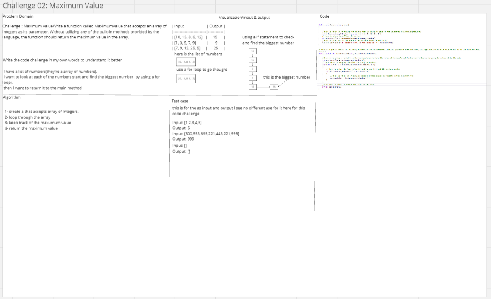

# challenges-and-data-structures
### Whiteboard Images

### Challenge A: Array Reversal

### Challenge B: Most Frequent Number

### Challenge 02: Maximum Value
## Write a function called MaximumValue that accepts an array of integers as its parameter. Without utilizing any of the built-in methods provided by the language, the function should return the maximum value in the array.

