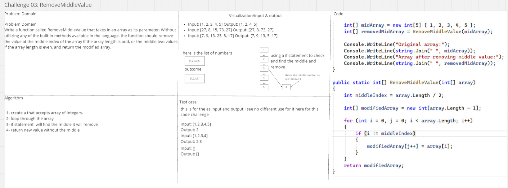
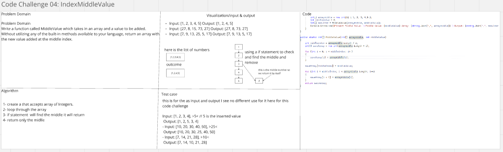
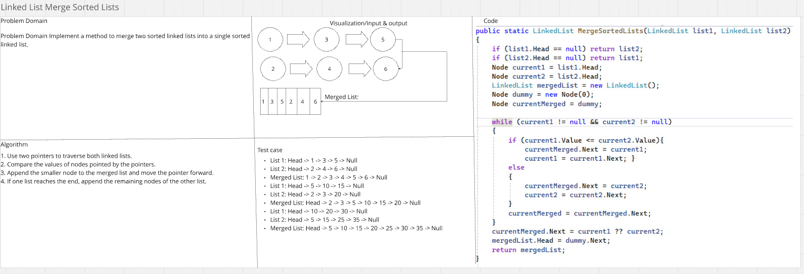

# challenges-and-data-structures
### Whiteboard Images

### Challenge A: Array Reversal

### Challenge B: Most Frequent Number

### Challenge C: RemoveMiddleValue

### Challenge D: Insert Middle Value 

### Linked List Merge Sorted Lists

### Stack

### Queue

