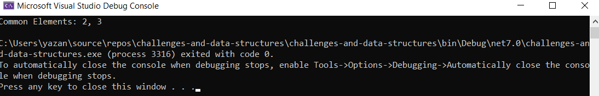

#Code Challenge information

###Challenge name
Challenge 05: Find Duplicates in Array

### Challenge Description
Write a function called FindDuplicates that accepts an array as its parameter.
Without utilizing any of the built-in methods provided by the language, 
the function should return an array of duplicate values 

### whiteboard image 

### Console output image

### Challenge A: Array Reversal

### Challenge B: Most Frequent Number
